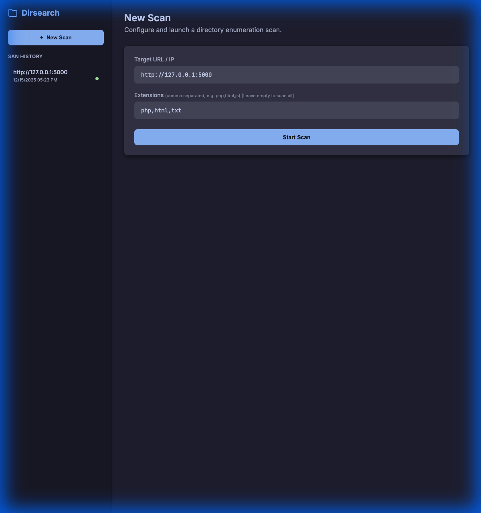

# DirSearch Pro UI



## Overview
**DirSearch Pro UI** is a modernized, professional Web Interface wrapper for the powerful [Dirsearch](https://github.com/maurosoria/dirsearch) web path scanner. 

This project enhances the core Dirsearch experience by providing a sleek, dark-themed dashboard, real-time log streaming, and persistent history management, making directory enumeration more efficient and user-friendly.

## Key Features
*   **Professional Web Interface**: A completely redesigned, responsive UI with a "Cyberpunk" inspired dark theme.
*   **Real-Time Feedback**: View live scan logs directly in the browser, with intelligent filtering to remove noisy progress bars.
*   **Persistent History**: Automatically saves scan history. A sidebar allows you to define and revisit past scans instantly.
*   **Optimized Performance**: Features a refactored Async Fuzzer engine using a worker pool pattern to prevent memory exhaustion on large wordlists.
*   **Result Management**:
    *   **Quick View**: Filter for "200 OK" results in a single click.
    *   **Exports**: Download results as CSV or TXT files.
*   **Interactive Control**: Stop scans gracefully directly from the UI.
*   **Modernized Core**: Includes fixes for legacy Python dependency warnings and improved code stability.

## Installation

### Prerequisites
*   Python 3.8 or higher
*   Git

### Step-by-Step Guide

1.  **Clone the Repository**
    ```bash
    git clone https://github.com/locatekrish/DirSearchUI.git
    cd DirSearchUI
    ```

2.  **Install Dependencies**
    It is recommended to use a virtual environment.
    ```bash
    python3 -m venv venv
    source venv/bin/activate  # On Windows: venv\Scripts\activate
    pip install -r requirements.txt
    ```

3.  **Run the Application**
    ```bash
    python3 web_gui.py
    ```

4.  **Access the Dashboard**
    Open your browser and navigate to:
    ```
    http://127.0.0.1:5000
    ```

## Usage
1.  **Start a Scan**: Enter the Target URL (e.g., `http://example.com`) and desired extensions (e.g., `php,html`).
2.  **Monitor**: Watch the real-time logs in the "Active Scan" view.
3.  **Review**: Once completed, results will appear in the table. Use "View 200 OK" for a quick summary.
4.  **History**: Click any item in the left sidebar to load previous scan details.

## Disclaimer & Credits
**This tool is built on top of the original [Dirsearch](https://github.com/maurosoria/dirsearch) by Mauro Soria.**

*   **Original Creator**: [Mauro Soria](https://github.com/maurosoria)
*   **Original Repository**: [https://github.com/maurosoria/dirsearch](https://github.com/maurosoria/dirsearch)

This project is a UI wrapper and enhancement set. All credit for the underlying scanning logic and original `dirsearch.py` implementation goes to Mauro Soria and the Dirsearch contributors.
